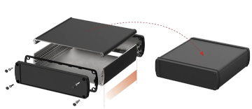

# MoGliFC – flight controller and generic CAN-FD interface
> MoGliFC is an STM32H743-based flight controller for copters ('drones') as well as aircraft with wings.
> Winged aircraft typically require servos to be connected to the flight controller while copters
> typically have no such requireemnt. MoGliFC addresses both use-cases by providing a scored extension board
> for the servo connectors which also holds the BEC for the servos. When removed, the signal outputs remain
> on the flight controller and are available e.g. as GPIOs, UARTs or PWM outputs.

> The second extension option is a larger frame which allows the MoGliFC to be placed in a BOPLA ALUBOS housing
> with the USB interface as well es the CAN/CAN-FD externally available turning the MogliFC into a general
> purpose CAN-FD interface. This second extension also holds a SWD (single wire debug) interface for easy debugging.

